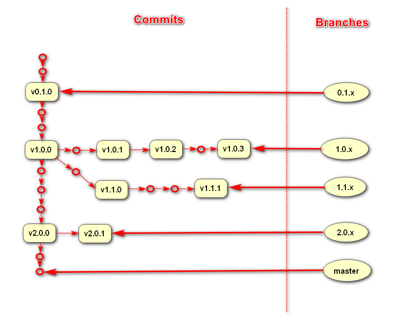

# Composer Package Versioning - Part 2 - Git Branches And Tags #

This is the second article on Composer package versioning. 

[The first article](../07/composer-package-versioning-part-1-breaking-changes.html) introduced the concept of breaking changes and semantic versioning as a way of communicating the risk of breaking changes.

This article reviews how to keep up with semantic versioning using Git.

Contents:

{{ toc }}

## Git Branches ##
 
After you created new package put under Git, you only have `master` branch. Develop next major or minor release on `master` branch.

After major or minor release create a new **release branch** pointing to the last patch for that release. Name such branches using version number of the release: `0.1.x`, `1.0.x`, `1.1.x`, `1.2.x` etc. 

Keep release branch as long as you support that version. After version, say, `1.0` is no longer supported (see [Support Window](#support-window)), delete `1.0.x` branch.   

Developing patch on the oldest release branch the patch is applicable to. After patch development is finished, merge or rebase the patch to all newer release branches it is applicable to.
   
This Git branching model is illustrated below:

  

## Git Tags ##

Tag last commit of major, minor or patch release with a version number prefixed with letter `v`: `v0.1.0`, `v1.0.0`, `v1.0.1`, `v1.0.2`, `v1.1.0` etc.

## Upgrade Guides ##

Document and publish all the breaking changes with every release as step-by-step upgrade guide. Address 2 types of readers:

* those who use public methods and functions
* those who extend your classes and hence use protected variables and methods  

## Support Window ##

With every major or minor release you will have to support more versions of your code base. After some time you may declare end-of-support for older versions. 

Pick sane balance:

* the more versions you support, the more effort is needed;
* the less versions you support, the more often users will be forced to do major version upgrades.
 
A lot of package maintainers have picked **fixed support window**: 

* They release major or minor version every 6 months (frequency varies). The day comes and whatever is ready to that day is released.
* They support the latest release and one previous release (sometimes none, sometimes more than one).

With this approach, user is supported no longer than 1 year after installation. In order to get support, user is forced to upgrade to new versions once a year.

As package matures, you may offer users more convenient support window by marking certain major or minor releases as **long-term support (LTS)** releases: 

* It means that you will support such releases longer than usual, for example for 3 years.
* After 3 years, you will mark other release as LTS release.
* Users following LTS releases will be able to do major upgrade less frequently.

## What's Next ##

The next part will provide step-by-step guide for supporting this Git branching model in shell.

[Discuss on HN]()     