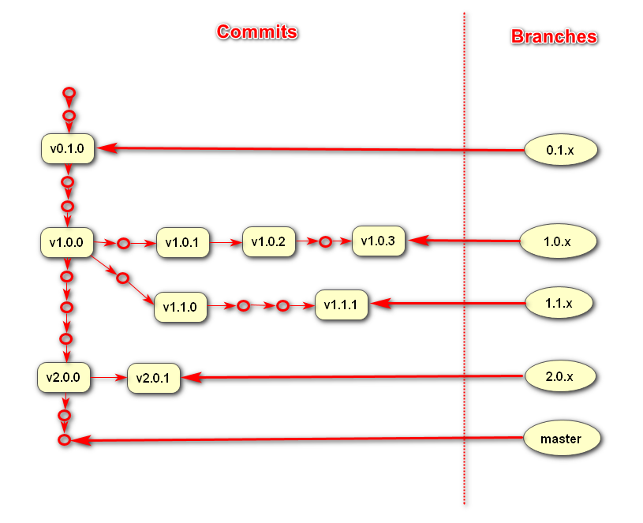

# Composer Package Versioning - Part 2 - Git Branches And Tags #

This is the second article on Composer package versioning. 

[The first article](../07/composer-package-versioning-part-1-breaking-changes.html) introduced the concept of breaking changes and semantic versioning as a way of communicating the risk of breaking changes to the user of your Composer package.

This article reviews how to keep up with semantic versioning using Git.

Contents:

{{ toc }}

## Git Branches ##
 
After you created new Composer package and put it under Git, you have only `master` branch. Develop next major or minor release on `master` branch.

After major or minor release create a new **release branch** pointing to the last patch for that release. Name such branches using version number of the release: `0.1.x`, `1.0.x`, `1.1.x`, `1.2.x` etc. 

Keep release branch as long as you support that version. After version, say, `1.0` is no longer supported (see [Support Window](#support-window)), delete `1.0.x` branch.   

Develop patch on the oldest release branch the patch is applicable to. After patch development is finished, merge or rebase the patch to all newer release branches (and to `master` branch) it is applicable to.
   
This Git branching model is illustrated below:

  

## Git Tags ##

Tag last commit of major, minor or patch release with a version number prefixed with letter `v`: `v0.1.0`, `v1.0.0`, `v1.0.1`, `v1.0.2`, `v1.1.0` etc.

## Upgrade Guides ##

Document and publish all the breaking changes with every release as step-by-step upgrade guide. Address two types of readers:

* those who use public methods and functions
* those who extend your classes and hence use protected variables and methods  

## Support Window ##

With every major or minor release you will have to support more versions of your code base. After some time you may declare end-of-support for older versions. 

Pick sane balance:

* the more versions you support, the more effort is needed;
* the less versions you support, the more often users will be forced to do major version upgrades.
 
A lot of package maintainers have picked **fixed support window**: 

* They release major or minor version every 6 months (frequency varies). The day comes and whatever is ready to that day is released.
* They support the latest release and one previous release (sometimes none, sometimes more than one).

With this approach, user is supported no longer than 1 year after installation. In order to get support, user is forced to upgrade to new versions once a year.

As package matures, you may offer users more convenient support window by marking certain major or minor releases as **long-term support (LTS)** releases: 

* It means that you will support such releases longer than usual, for example for 3 years.
* After 3 years, you will mark other release as LTS release.
* Users following LTS releases will be able to do major upgrade less frequently.

## What's Next ##

The next part will provide step-by-step guide for working with this Git branching model in shell.

[Discuss on HN](https://news.ycombinator.com/item?id=20605961)     